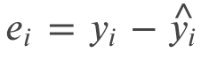
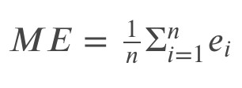
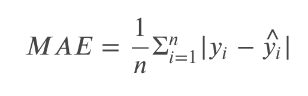
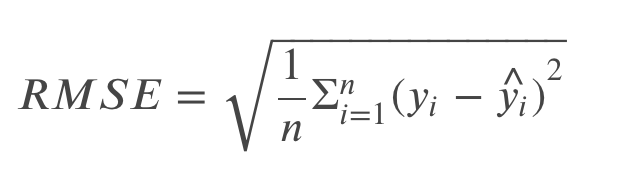
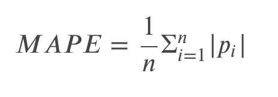

## Error Measures

There's some metrics of evaluation. The metric itself is a form of error measurement which
actually used to measure accuracy. Accuracy is the difference between the result of a measurement
and the actual value. Before we dig deeper into error measurement, we should start by understanding error.
Generally, an error (e) is the difference between the actual value of measurement on certain observation and
the predicted value.

The simplest form of error measurement is called mean error which actually the average of error.

There's a downside of this method, let's imagine that we have negative and positive numbers,
their errors might level each one out, although they are both quite far away from the actual value.
To prevent this, new methods are introduced: the mean absolute error (MAE) and root mean squared error (RMSE).

MAE solves the problem by taking the absolute value of the difference between both the actual and predicted value.
This is actually an effective method.

RMSE, however, first takes positive difference by squaring, and afterwards takes the root square of
the average squared error to obtain its result. This approach is prone to outliers since doing the squared-based
approach produce larger error.

As we noticed that all of these measurements based on residuals, they are scale-dependent.

There's actually a way to make it scale-independent, this can be produced by making a ratio, one of the approach
that can be used is producing the percentage error.
percentage error is typically measured for a whole dataset by the mean absolute percentage error (MAPE).

The MAPE is often used in forecasting for trend prediction especially in time series analysis.
However, MAPE also has some drawbacks. It cannot be used when the actual value is 0,
as we cannot make a division by 0. In the very small observations close to 0,
the error will also become infinitely large. Furthermore, the minimum is always 0,
while the upper bound is unlimited. Hence, small errors can't be captured as precisely as highly-deviating errors.

For nominal values used for cross-sectional/classification models,
the error is expressed slightly different, which usually discussed inside of the confusion matrix.
